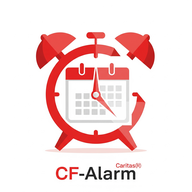
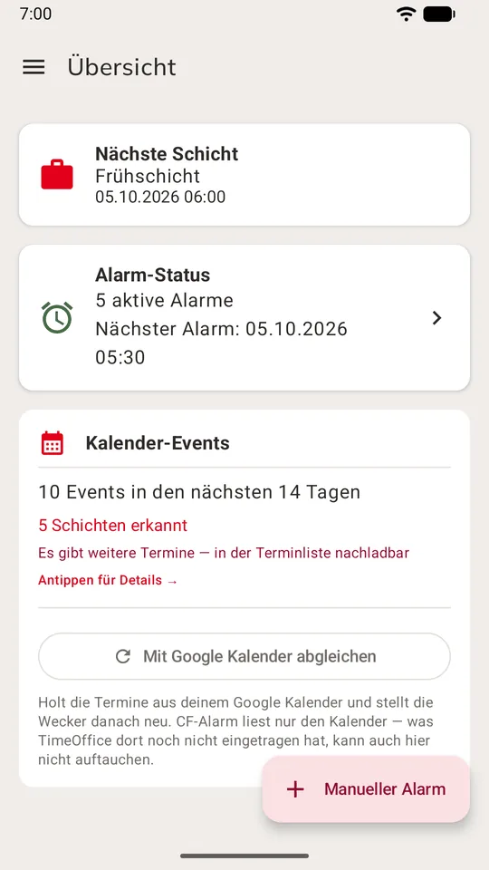
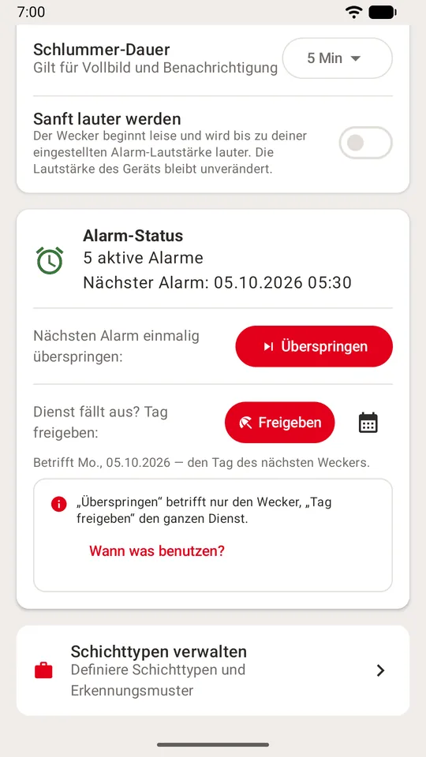
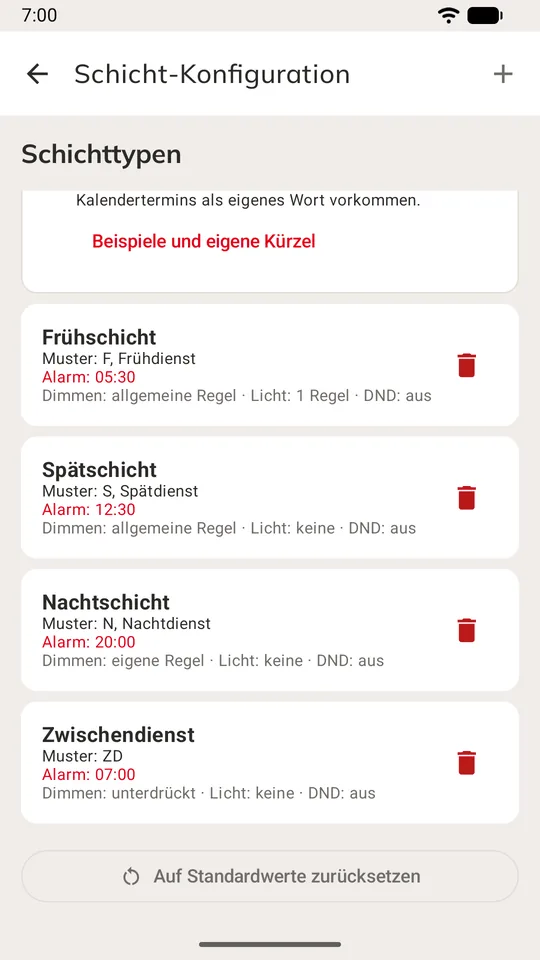
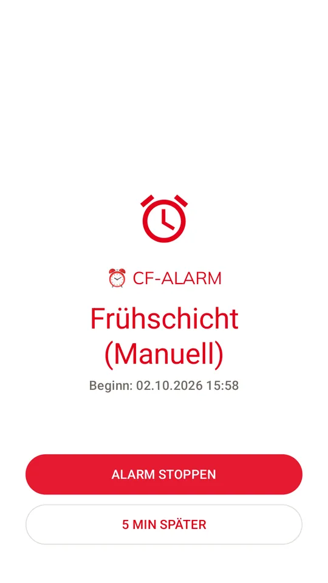

# CF-Alarm for TimeOffice

<div align="center">




**Wecker aus dem Dienstplan: CF-Alarm erkennt deine Schichten im Google Kalender und stellt die passenden Wecker – mit Schicht-Dimmer, „Nicht stören“-Automatik und Philips Hue.**

[Website mit Anleitung und Hilfe](https://cf-alarm.duckdns.org) • [Changelog](https://cf-alarm.duckdns.org/changelog.html) • [Datenschutz](https://cf-alarm.duckdns.org/privacy.html)

</div>

<p align="center">
  
  
  
  
</p>

## Was die App macht

Wer im Schichtdienst arbeitet und seinen Dienstplan im Google Kalender hat – zum Beispiel, weil TimeOffice ihn dort einträgt –, muss keine Wecker mehr von Hand stellen. CF-Alarm liest den Kalender, erkennt die Schichten an ihren Kürzeln im Termintitel und stellt für jeden Schichttyp den Wecker zur eingestellten Zeit. Ändert sich der Plan, zieht der Wecker nach.

CF-Alarm erkennt **Schichten**, keine beliebigen Termine. Für einen Kalender mit Arztterminen und Geburtstagen ist sie nicht gedacht.

Die App hat sechs Bereiche, erreichbar über das Menü: **Übersicht**, **Wecker**, **Schicht-Dimmer**, **Philips Hue**, **System-Status**, **Einstellungen**.

### Wecker aus dem Dienstplan
- **Schichttypen** mit eigener Weckzeit und beliebig vielen Erkennungsmustern. Ein Muster trifft nur als eigenes Wort – „F“ erkennt den Termin „F“, nicht „Fortbildung“. Vorgabe für neue Installationen: Früh-, Spät- und Nachtschicht (F, S, N) und Zwischendienst (ZD).
- **Kürzel-Vorschläge** aus dem echten Kalender: Termintitel ohne passendes Muster stehen in einer eigenen Karte und lassen sich mit einem Tipp einer Schicht zuordnen. Die App ordnet nichts von selbst zu.
- **Statuszeile je Schicht**: was eine Schicht außer dem Wecker auslöst (Dimmen, Licht, „Nicht stören“).
- **Kalender-Vorausschau** von 7 bis 90 Tagen, einstellbar.
- **Überspringen** lässt den nächsten Wecker einmal aus; **Tag freigeben** streicht einen ausgefallenen Dienst – kein Wecker, kein „Nicht stören“.
- **Manueller Alarm** für Tage, die nicht im Plan stehen.
- **Schlummer-Dauer** 3/5/10/15 Minuten und auf Wunsch **sanft lauter werdender** Weckton.
- **Stille Schicht**: kein Weckton, Dimmen und „Nicht stören“ richten sich trotzdem nach ihr.
- **Rufbereitschaft** als Eigenschaft eines Schichttyps: an solchen Tagen schaut die App stündlich in den Kalender.
- **Hinweis bei Dienstplan-Änderungen** (abschaltbar).

### Zuverlässigkeit im Hintergrund
- Abgleich mit dem Kalender alle 6 Stunden und 3 Stunden vor jedem Wecker; erkennt neue, geänderte und gestrichene Schichten.
- Nach Neustart und Update stellt die App ihre Wecker selbst wieder her.
- Ohne Internet zeigt die Übersicht die zuletzt bekannte nächste Schicht; die gestellten Wecker bleiben.
- Der **System-Status** zeigt, was einen Wecker verhindern kann – Akku-Optimierung, „App bei Nichtnutzung pausieren“, blockierte Benachrichtigungen, ein nicht abrufbarer Kalender und die Zuverlässigkeit von TimeOffice selbst.
- **Hintergrunddienste pausieren** hält alles gemeinsam an – Wecker, Dimmer, „Nicht stören“ und Hue-Automatik –, auch über einen Neustart hinweg.

### Schicht-Dimmer (optional)
- Dunkelt den Bildschirm zu deinen Schlafzeiten ab, auch unter die kleinste Helligkeit, die Android erlaubt.
- Ein Hauptschalter; wann gedimmt wird, steht ausschließlich in **Regeln** – für alle Tage oder je Schicht, mit Zeitfenstern relativ zu Uhrzeit, Weckzeit oder Schichtende und auf Wunsch abhängig von der Position in einer Dienstfolge (erster, mittlerer, letzter Tag).
- Vorlagen: **Nacht-Dimmen**, **Nachtdienst-Rhythmus** und **Schicht ausnehmen**; dazu eine Vorschau der nächsten Tage.
- Korrektur aus der Benachrichtigung: „Heller“, „Dunkler“, „Pause“.
- Abgedunkelt wird über einen **Bedienungshilfen-Dienst**, den du selbst einschaltest. Er legt nur eine dunkle Fläche über den Bildschirm und liest keine Inhalte.

### „Nicht stören“ automatisch (optional, ab Android 11)
- Zwei Auslöser: **Schlaf-Fenster folgt dem Dimmer** und **Während der Dienstzeit** (einzelne Schichten ausnehmbar).
- An Rufbereitschaftstagen endet „Nicht stören“ zu einer festen Uhrzeit.
- Frei wählbar, was stumm bleibt. Der eigene Wecker klingelt immer.
- Ein eigener Zeitplan in den Android-Einstellungen; manuelles „Nicht stören“ bleibt unberührt.

### Philips Hue (optional)
- Bridge-Suche im lokalen Netzwerk, Kopplung per Link-Taste.
- Regeln je Schichttyp oder für alle Schichten, auf eine von drei Arten: **Szene** aus der Hue-App (auch mehrere Räume), **manuell** mit eigener Helligkeit und Farbe oder **Sonnenaufgang**.
- Das automatische Ausschalten liegt als Zeitplan auf der Bridge und greift auch, wenn das Handy nicht mehr im WLAN ist.

### Sichern und Gerätewechsel
- **Exportieren / Importieren** von Schichttypen, Hue-, Dimmer- und „Nicht stören“-Einstellungen als Datei.
- Mit Androids Datensicherung kommen die Einstellungen aufs neue Handy mit; ab Android 9 meldet die App dich dort selbst wieder an.

### Datenschutz
- Der Kalender wird nur **gelesen** (`calendar.readonly`).
- Keine eigenen Server, keine Werbung, keine Analyse-Dienste.
- Gespeichert werden die erkannten Schichten mit ihren Uhrzeiten, keine Termininhalte; das Google-Token liegt mit AES-256-GCM verschlüsselt auf dem Gerät.
- Einzelheiten: [Datenschutzerklärung](https://cf-alarm.duckdns.org/privacy.html).

## Voraussetzungen

- **Android 8.0** oder neuer; „Nicht stören“-Automatik ab **Android 11**
- Ein **Google-Konto** mit einem Kalender, in dem die Dienste als Termine stehen
- Optional eine **Philips Hue Bridge** im selben WLAN

## Am Test teilnehmen

Die App ist noch nicht öffentlich im Play Store; sie geht über einen Testzugang an eine kleine Gruppe, derzeit vor allem Kolleginnen und Kollegen aus der Pflege. Entwickelt wird sie von einer Einzelperson in der Freizeit.

1. Kurze Nachricht an **cfischer@csj.de** oder über GitHub ([@F1rlefanz](https://github.com/F1rlefanz)).
2. Über den Link, den du bekommst, die App bei Google Play installieren.
3. Der [Anleitung](https://cf-alarm.duckdns.org/advanced-setup.html) folgen: anmelden, Kalender wählen, Hintergrund freigeben, Kürzel zuordnen.

**Problem melden:** In der App unter **System-Status** → Karte „Debug-Informationen“ → **„Logs an Entwickler senden“**. Es öffnet sich der Teilen-Dialog, vorausgefüllt als E-Mail; angehängt werden die Protokolle der letzten Tage.

## Für Entwickler

Kotlin, Jetpack Compose (Material 3), MVVM mit Hilt. Hintergrundarbeit über AlarmManager (exakte Alarme) und WorkManager, Einstellungen in DataStore, Kalender über die Google Calendar API, Hue über die lokale Bridge-API.

- `minSdk = 26`, `targetSdk = 37`, `compileSdk = 37`, Java 17 mit Core Library Desugaring
- Release-Builds laufen durch R8.
- Unit-Tests in `app/src/test`, Instrumentation-Tests in `app/src/androidTest`; die CI baut Tests, Lint, Debug- und Release-Build.

**Build-Voraussetzung:** eine `keystore.properties` im Projekt-Root mit mindestens `googleWebClientId` (Google-OAuth-Client-ID). Ohne diesen Wert bricht der Build ab.

```bash
./gradlew assembleDebug        # Debug-Build
./gradlew testDebugUnitTest    # Unit-Tests
./gradlew lint                 # Lint
./gradlew assembleRelease      # Release-Build (braucht Netzzugang)
```

Wer beitragen möchte, meldet sich am einfachsten direkt beim Entwickler oder legt ein Issue an.

## Lizenz

MIT License – siehe [LICENSE](LICENSE).

## Credits

Entwickelt von [F1rlefanz](https://github.com/F1rlefanz) für Kolleginnen und Kollegen im Schichtdienst – gebaut mit Android Studio, unterstützt durch Claude und Gemini als Entwicklungswerkzeuge.
